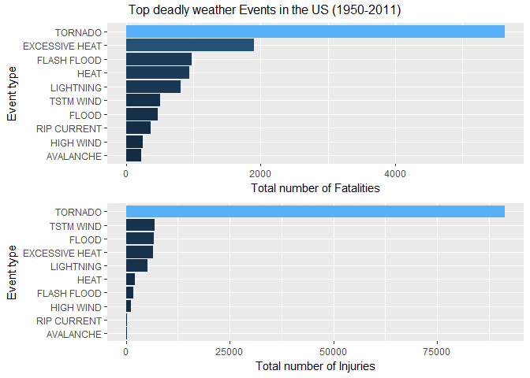
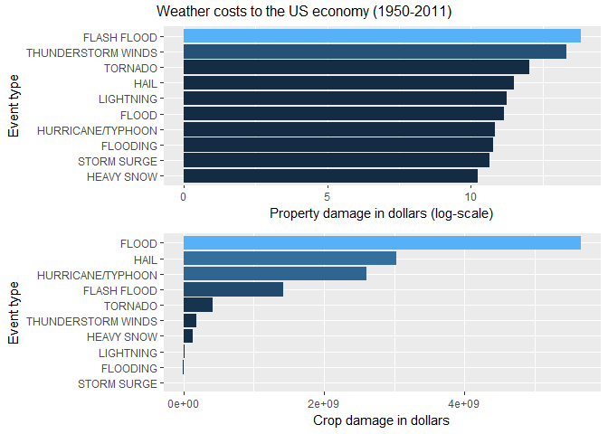

# Reproducible Research: Peer Assessment 2

# Health and Economic Impact of Weather Events in the US

Storms and other severe weather events can cause both public health and economic
problems for communities and municipalities. Many severe events can result in
fatalities, injuries, and property damage, and preventing such outcomes to the extent
possible is a key concern.

This project involves exploring the U.S. National Oceanic and Atmospheric
Administration's (NOAA) storm database. This database tracks characteristics of major
storms and weather events in the United States, including when and where they occur, as
well as estimates of any fatalities, injuries, and property damage.


```r
# Load Required Libraries
library(plyr)
library(dplyr)
```

```
## 
## Attaching package: 'dplyr'
```

```
## The following objects are masked from 'package:plyr':
## 
##     arrange, count, desc, failwith, id, mutate, rename, summarise,
##     summarize
```

```
## The following objects are masked from 'package:stats':
## 
##     filter, lag
```

```
## The following objects are masked from 'package:base':
## 
##     intersect, setdiff, setequal, union
```

```r
library(knitr)
library(ggplot2)
library(gridExtra)
```

```
## 
## Attaching package: 'gridExtra'
```

```
## The following object is masked from 'package:dplyr':
## 
##     combine
```

# Synopsis

The Analysis on the strom event database was done for 2 major impact
1. Health Impact like - Facalities & Injuries
    + Tornadoes, Excessive heat, Flash food are top 3 events causing major health distubance
2. Economic Impack like - Property Damage & Crop Damage
    + Flash floods, Thunderstroam winds, tornado are top 3 events causing maximum property damage
    + Drought, floods, River flood are top 3 events causing maximum crop damage

# Data Processing

The analysis was performed on
[Storm Events Database](http://www.ncdc.noaa.gov/stormevents/ftp.jsp), provided by
[National Climatic Data Center](http://www.ncdc.noaa.gov/). The data is from a comma-separated-value file available
[here](https://d396qusza40orc.cloudfront.net/repdata%2Fdata%2FStormData.csv.bz2).
There is also some documentation of the data available
[here](https://d396qusza40orc.cloudfront.net/repdata%2Fpeer2_doc%2Fpd01016005curr.pdf).


## Step 1) Load data

```r
storm <- read.csv(bzfile("data/repdata-data-StormData.csv.bz2"))
```

Before the analysis, the data need some preprocessing. Event types don't have a
specific format. For instance, there are events with types `Frost/Freeze`,
`FROST/FREEZE` and `FROST\\FREEZE` which obviously refer to the same type of
event.

## Step 2) Get Unique Events

```r
event_types <- tolower(storm$EVTYPE)
## replace all punct. characters with a space
event_types <- gsub("[[:blank:][:punct:]+]", " ", event_types)
uniqueEvent <- length(unique(event_types))
```

No further data preprocessing was performed although the event type field can be
processed further to merge event types such as `tstm wind` and `thunderstorm wind`. 
After the cleaning, as expected, the number of unique event types reduce
significantly. For further analysis, the cleaned event types are used.

### Number of Unique Events found in database are - 874

# Top 10 most harmful Events with respect to Population Health

To find the event types that are most harmful to population health, the number
of casualties are aggregated by the event type.

## Step 3) Get Casualities from FATALITIES, INJURIES column

```r
casualties <- storm %>% select(EVTYPE , FATALITIES, INJURIES) %>% 
                group_by(EVTYPE) %>%
                summarise(FATALITIES = sum(FATALITIES), INJURIES = sum(INJURIES)) %>%
                arrange(desc(FATALITIES), desc(INJURIES))
```

## Step 4) Find top 10 events that caused most death and injury


```r
fatal_events_10 <- casualties %>% select(EVTYPE , FATALITIES) %>%  head(10)
injury_events_10 <- casualties %>% select(EVTYPE , INJURIES) %>%  head(10)
```

### Top 10 events that caused largest number of deaths (FATALITIES)

```r
kable(fatal_events_10)
```


EVTYPE            FATALITIES
---------------  -----------
TORNADO                 5633
EXCESSIVE HEAT          1903
FLASH FLOOD              978
HEAT                     937
LIGHTNING                816
TSTM WIND                504
FLOOD                    470
RIP CURRENT              368
HIGH WIND                248
AVALANCHE                224
### Top 10 events that caused largest number of injuries (INJURIES)

```r
kable(injury_events_10)
```


EVTYPE            INJURIES
---------------  ---------
TORNADO              91346
EXCESSIVE HEAT        6525
FLASH FLOOD           1777
HEAT                  2100
LIGHTNING             5230
TSTM WIND             6957
FLOOD                 6789
RIP CURRENT            232
HIGH WIND             1137
AVALANCHE              170

# Top 10 most harmful Events with respect to Economic Loss

To analyze the impact of weather events on the economy, available property
damage and crop damage reportings/estimates were used.

In the raw data, the property damage is represented with two fields, a number
`PROPDMG` in dollars and the exponent `PROPDMGEXP`. Similarly, the crop damage
is represented using two fields, `CROPDMG` and `CROPDMGEXP`. The first step in the
analysis is to calculate the property and crop damage for each event.

## Step 5) Function Call to Transform K,M,B initialis of Dollor into Actual Amount

```r
exp_transform <- function(e) {
    # h -> hundred, k -> thousand, m -> million, b -> billion
    if (e %in% c('h', 'H'))
        return(2)
    else if (e %in% c('k', 'K'))
        return(3)
    else if (e %in% c('m', 'M'))
        return(6)
    else if (e %in% c('b', 'B'))
        return(9)
    else if (!is.na(as.numeric(e))) # if a digit
        return(as.numeric(e))
    else if (e %in% c('', '-', '?', '+'))
        return(0)
    else {
        stop("Invalid exponent value.")
    }
}
```

## Step 6) Transform K,M,B initialis of Dollor into Actual Amount

```r
prop_dmg_exp <- sapply(storm$PROPDMGEXP, FUN=exp_transform)
storm$prop_dmg <- storm$PROPDMG * (10 ** prop_dmg_exp)
crop_dmg_exp <- sapply(storm$CROPDMGEXP, FUN=exp_transform)
storm$crop_dmg <- storm$CROPDMG * (10 ** crop_dmg_exp)
```

## Step 7) Get Economic loss from prop_dmg, crop_dmg column

```r
# Compute the economic loss by event type
economicsLoss <- storm %>% select(EVTYPE , prop_dmg, crop_dmg) %>% 
                  group_by(EVTYPE) %>%
                  summarise(prop_dmg = sum(prop_dmg), crop_dmg = sum(crop_dmg)) %>%
                  arrange(desc(prop_dmg), desc(crop_dmg))
```

## Step 8) Find top 10 events that caused most propert and crop damage


```r
prop_dmg_10 <- economicsLoss %>% select(EVTYPE , prop_dmg) %>%  head(10)
crop_dmg_10 <- economicsLoss %>% select(EVTYPE , crop_dmg) %>%  head(10)
```

### Top 10 events that caused most property damage (in dollars) are as follows


```r
kable(prop_dmg_10)
```


EVTYPE                    prop_dmg
-------------------  -------------
FLASH FLOOD           6.820237e+13
THUNDERSTORM WINDS    2.086532e+13
TORNADO               1.078951e+12
HAIL                  3.157558e+11
LIGHTNING             1.729433e+11
FLOOD                 1.446577e+11
HURRICANE/TYPHOON     6.930584e+10
FLOODING              5.920826e+10
STORM SURGE           4.332354e+10
HEAVY SNOW            1.793259e+10

### Top 10 events that caused most crop damage (in dollars) are as follows


```r
kable(crop_dmg_10)
```


EVTYPE                  crop_dmg
-------------------  -----------
FLASH FLOOD           1421317100
THUNDERSTORM WINDS     190734780
TORNADO                415113110
HAIL                  3025974480
LIGHTNING               12092090
FLOOD                 5661968450
HURRICANE/TYPHOON     2607872800
FLOODING                 8855500
STORM SURGE                 5000
HEAVY SNOW             134653100

# Conclusion (Communicating Results using Plots)

## Health impact of weather events

The following plot shows top dangerous weather event types.


```r
p1 <- ggplot(data=fatal_events_10,
             aes(x=reorder(EVTYPE, FATALITIES), y=FATALITIES, fill=FATALITIES)) +
    geom_bar(stat="identity") +
    coord_flip() +
    ylab("Total number of Fatalities") +
    xlab("Event type") +
    theme(legend.position="none")

p2 <- ggplot(data=injury_events_10,
             aes(x=reorder(EVTYPE, INJURIES), y=INJURIES, fill=INJURIES)) +
    geom_bar(stat="identity") +
    coord_flip() + 
    ylab("Total number of Injuries") +
    xlab("Event type") +
    theme(legend.position="none")

grid.arrange(p1, p2, nrow=2, top="Top deadly weather Events in the US (1950-2011)")
```

<!-- -->

Tornadoes cause most number of deaths and injuries among all event types. There 
are more than 5,000 deaths and more than 10,000 injuries in the last 60 years
in US, due to tornadoes. 
The other event types that are most dangerous with respect to population health
are excessive heat and flash floods.

## Economic impact of weather events

The following plot shows the most severe weather event types with respect to
economic cost that they have costed since 1950s.


```r
p1 <- ggplot(data=prop_dmg_10,
             aes(x=reorder(EVTYPE, prop_dmg), y=log10(prop_dmg), fill=prop_dmg )) +
    geom_bar(stat="identity") +
    coord_flip() +
    xlab("Event type") +
    ylab("Property damage in dollars (log-scale)") +
    theme(legend.position="none")

p2 <- ggplot(data=crop_dmg_10,
             aes(x=reorder(EVTYPE, crop_dmg), y=crop_dmg, fill=crop_dmg)) +
    geom_bar(stat="identity") +
    coord_flip() + 
    xlab("Event type") +
    ylab("Crop damage in dollars") + 
    theme(legend.position="none")

grid.arrange(p1, p2, nrow=2, top="Weather costs to the US economy (1950-2011)")
```

<!-- -->

Property damages are given in logarithmic scale due to large range of values.
The data shows that flash floods and thunderstorm winds cost the largest
property damages among weather-related natural diseasters. Note that, due to
untidy nature of the available data, type `flood` and `flash flood` are
separate values and should be merged for more accurate data-driven conclusions.

The most severe weather event in terms of crop damage is the drought. In the last
half century, the drought has caused more than 10 billion dollars damage. Other
severe crop-damage-causing event types are floods and hails.
